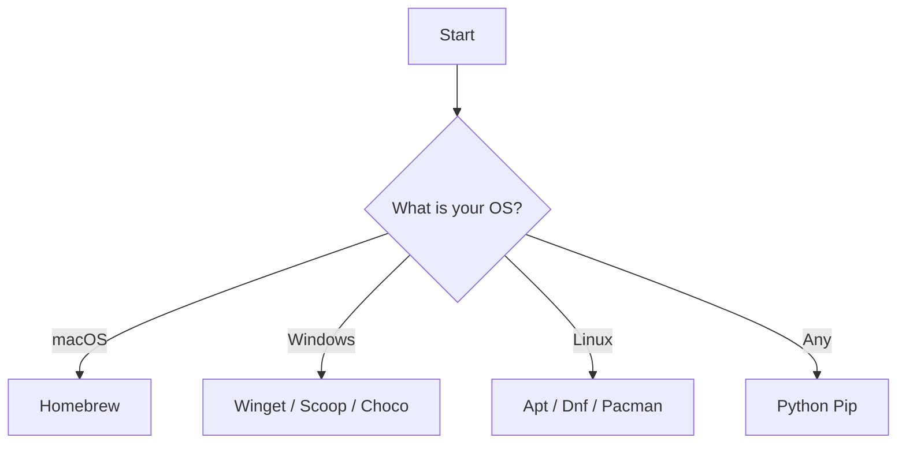

import Tabs from '@theme/Tabs';
import TabItem from '@theme/TabItem';

# Installation

Ready to make APIs human-friendly? Let’s get **HTTPie** installed on your machine. 

## Objective
By the end of this guide, you will have the HTTPie Command Line Interface (CLI) installed and verified on your operating system.

## Prerequisites
* Access to a terminal or command prompt.
* Administrator or `sudo` privileges on your machine.

## Step-by-Step Instructions

Choose your path to installation:



Select your operating system below to see the specific commands.

<Tabs>
  <TabItem value="mac" label="macOS" default>

Use Homebrew for the easiest maintenance.
1.  Open your terminal.
2.  Run the installation command:
    ```bash
    brew install httpie
    ```
3.  Wait for Homebrew to link the binary.

  </TabItem>
  <TabItem value="win" label="Windows">
    
You can install HTTPie via **Winget**, **Scoop**, or **Chocolatey**.

1.  Open PowerShell or Command Prompt.
2.  Run **one** of the following commands:

    **Using Winget (Recommended):**
    ```powershell
    winget install httpie
    ```

    **Using Chocolatey:**
    ```powershell
    choco install httpie
    ```

  </TabItem>
  <TabItem value="linux" label="Linux">

HTTPie is available in most package managers.

**Debian/Ubuntu:**
```bash
curl -SsL [https://packages.httpie.io/deb/KEY.gpg](https://packages.httpie.io/deb/KEY.gpg) | sudo gpg --dearmor -o /usr/share/keyrings/httpie.gpg
echo "deb [arch=amd64 signed-by=/usr/share/keyrings/httpie.gpg] [https://packages.httpie.io/deb](https://packages.httpie.io/deb) ./" | sudo tee /etc/apt/sources.list.d/httpie.list
sudo apt update
sudo apt install httpie
```

**Fedora/RHEL:**
```bash
sudo dnf install httpie
```

**Arch Linux:**
```bash
sudo pacman -S httpie
```

</TabItem> <TabItem value="python" label="Python (Universal)">


If you have Python installed, you can use <code>pip</code> on any OS.

```bash
pip install httpie
```

</TabItem> </Tabs>

## Verification

Let’s make sure everything is working correctly.

1.  Run the version command:

    ```bash
    http --version
    ```

2.  You should see an output similar to `3.2.2` (or the latest version).

   :::tip Success!
    If you see the version number, you are ready to go.
    :::

:::warning Troubleshooting
If your terminal prints `command not found`:
1.  Restart your terminal session to refresh your system paths.
2.  Ensure the installation directory is in your system's `PATH`.
3.  Reinstall with `pipx install httpie` (recommended) or your OS package manager.
:::
## Next Steps

Now that you're set up, let's send your first request!

[👉 Your First Request](./first-request)
