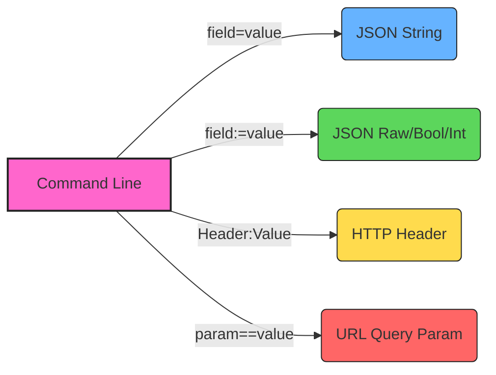

import Tabs from '@theme/Tabs';
import TabItem from '@theme/TabItem';

# Basic Concepts

Sending a simple GET request is easy. But real-world development requires sending data, setting headers, and authentication. HTTPie uses a unique, expressive syntax to handle these without writing raw JSON.

## Objective
You will learn how to map specific syntax symbols (`=`, `:`, `==`) to HTTP concepts like JSON fields, Headers, and URL parameters.





## The Syntax Mapping
HTTPie determines *what* you are sending based on the separator you use.

| Operator | Meaning | Example |
| :--- | :--- | :--- |
| `field=value` | **Data Field** (String) | `name=John` |
| `field:=value` | **Raw JSON** (Bool/Int) | `active:=true` |
| `Header:Value` | **HTTP Header** | `X-API-Token:123` |
| `param==value` | **URL Parameter** | `q==search` |

## Interactive Examples

Explore how to construct different types of requests below.

<Tabs>
  <TabItem value="json" label="Sending JSON" default>

### Sending Data
To send a JSON object, simply list the fields after the URL. HTTPie automatically sets the `Content-Type` header to `application/json`.

**Command:**
```bash
http POST httpbin.org/post name=Alice age:=30 isDeveloper:=true
```

**What happens behind the scenes:** HTTPie constructs this JSON body:
```JSON
{
  "name": "Alice",
  "age": 30,
  "isDeveloper": true
}
```

</TabItem> <TabItem value="headers" label="Custom Headers">

**Setting Headers**

To add authentication tokens or custom headers, use the colon `:` separator.

**Command:**

```
http GET httpbin.org/headers Authorization:"Bearer my-token-123" User-Agent:MyBot/1.0
```

**Explanation:**
<ul>
  <li> <code>Authorization</code> is added to the request headers.</li>
  <li> <code>User-Agent</code> is overwritten with your custom value.</li>
</ul>

</TabItem> <TabItem value="query" label="Query Params">

**URL Parameters**

Don't worry about escaping `?` or `&` in your terminal. Use the double equals `==`.

**Command:**

```bash
http GET httpbin.org/get page==2 sort==desc
```

Actual URL Requested: `http://httpbin.org/get?page=2&sort=desc`
</TabItem> </Tabs>

### Shortcuts for Localhost
If you develop locally, typing localhost gets repetitive. HTTPie supports shorthand for ports.
<ul>
  <li> <code>http :3000/users</code> → <code>http://localhost:3000/users</code></li>
  <li> <code>http :/tags</code> → <code>http://localhost/tags</code></li>
</ul>

### Summary

You now possess the core syntax logic:

1.  `=` for text data.
2.  `:=` for non-string data (numbers, booleans).
3.  `:` for Headers.
4.  `==` for URL query strings.

> [!TIP]
> **Next Steps**
>
> Now that you understand the basics, check out our Guides section to see how to handle file uploads and sessions!
