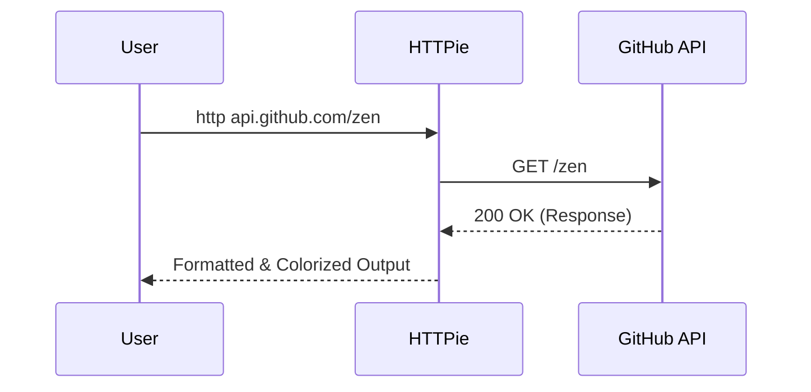

# Your First Request

Now that you have the toolbelt installed, let's verify that HTTPie lives up to its promise: making APIs simple.

## Objective
You will send a `GET` request to a public API and inspect the formatted, colorized response.





## Prerequisites
* [Installation](./installation) is complete.
* Internet connection.

## The "Hello World" of HTTPie

In traditional tools like `curl`, you might need to add flags to format JSON or colorize output. HTTPie does this by default.

### Step 1: Send the Request
We will query the GitHub API. It is public, fast, and returns nice JSON data.

Copy and paste this command into your terminal:

> [!TIP]
> **Try it!**
> ```bash
> http https://api.github.com/zen
> ```
### Step 2: Analyze the Output

You should see two distinct sections in your terminal:

1.  **Headers:** The metadata about the response (status code, date, content type).
2.  **Body:** The actual data returned by the server.

It will look something like this:

```HTTP
HTTP/1.1 200 OK
Content-Type: text/plain;charset=utf-8
Server: GitHub.com
Date: Mon, 24 Nov 2025 12:00:00 GMT

Avoid administrative distraction.
```

> [!Note]
Shorthand Syntax HTTPie is smart. You don't always need to type `https://`. If you run `http api.github.com/zen`, it defaults to `http`. For secure requests, explicitly type https

### Why this matters

Notice what you didn't have to do:

*   You didn't use `-v` to see headers.
*   You didn't pipe to a formatter to make it readable.
*   You didn't struggle with complex flags.

HTTPie assumes you want to see the whole conversation (headers and body) formatted for human eyes.

## Next Steps

Ready to master the syntax?

[👉 Basic Concepts](./basic-concepts)
