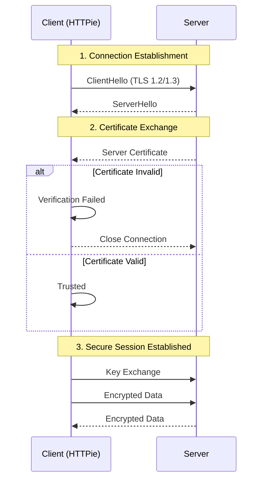

import Tabs from '@theme/Tabs';
import TabItem from '@theme/TabItem';

# Common Issues

Even the best tools encounter network hiccups. Here is how to resolve the most frequent errors.

## Objective
Diagnose and fix connectivity and SSL issues when using HTTPie.


## SSL Handshake Process
Understanding where the connection fails can help you pinpoint the issue. Here is a simplified view of the SSL/TLS handshake:




## Troubleshooting Guide

<Tabs>
  <TabItem value="ssl" label="SSL/TLS Errors" default>

### SSL Certificate Verification Failed
**Error:** `requests.exceptions.SSLError: [SSL: CERTIFICATE_VERIFY_FAILED]`

**Cause:** You are connecting to a server with a self-signed or expired certificate (common in staging environments).

**Solution:**
Use the `--verify=no` flag to bypass verification.
```bash
http --verify=no GET [https://internal-api.local](https://internal-api.local)
```

Warning: Only use this for trusted local networks.

</TabItem> <TabItem value="timeout" label="Timeouts">

